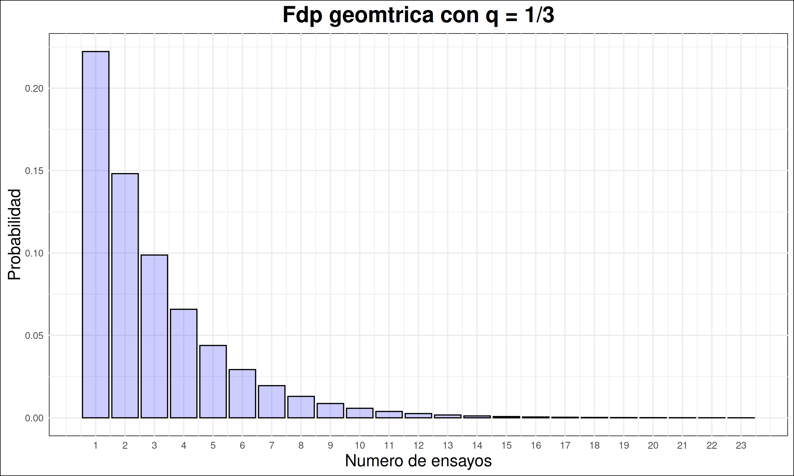
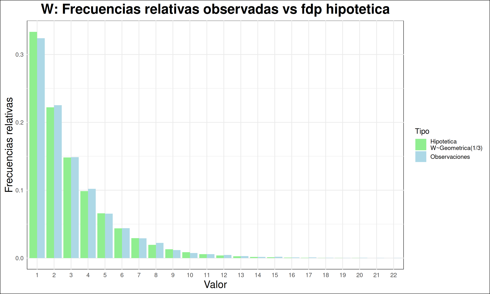
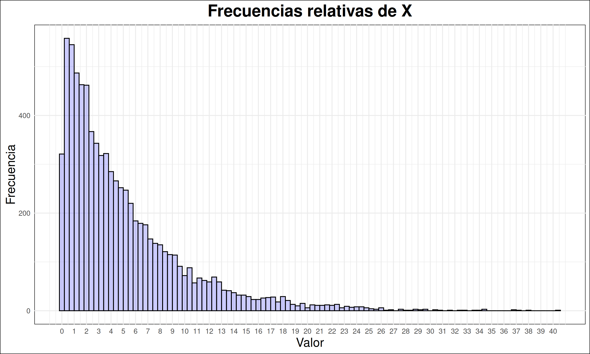
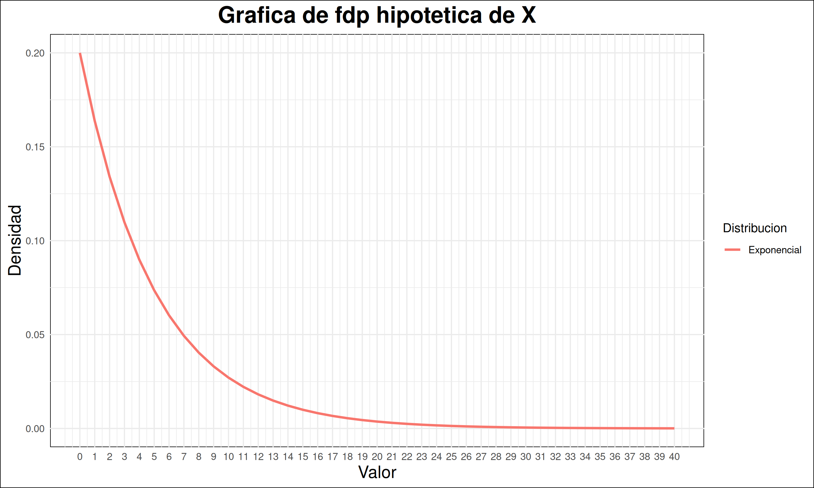
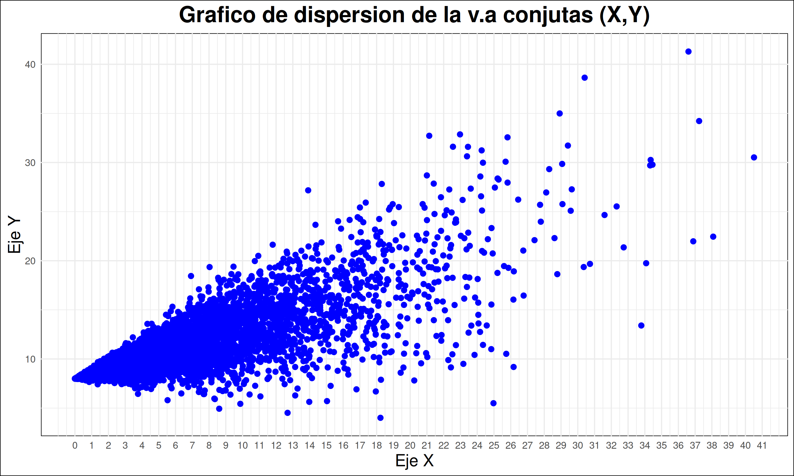

# PyE Proyecto práctico - Analisis de datos

Este análisis se centra en el estudio de dos variables aleatorias ( W )
y ( X ), a partir de muestras observadas. Se presentan las
distribuciones teóricas propuestas, medidas descriptivas, y
comparaciones entre las características muestrales y poblacionales.
Además, se analiza la relación entre ( X ) y ( Y ) mediante un modelo de
regresión lineal.

## Para las muestras de la variable aleatoria W

### Histograma de frecuencias de W

**Distribución propuesta:** Se sugiere que la variable W sigue una
**distribución geométrica**. Las demás distribuciones fueron descartadas
por los siguientes motivos:

-   **Binomial:** Esta distribución comienza en 0, mientras que W
    comienza en 1, por lo que fue descartada.

-   **Uniforme:** La gráfica no se asemeja al histograma de frecuencias
    de W.

-   **Poisson:** La media y la varianza deben ser iguales; dado que no
    se aproximan, se descartó.

-   **Binomial negativa:** Dado que el mínimo de W es 1, tenemos que
    *K* = 1, lo que nos lleva al caso particular de la binomial
    negativa, donde *W* ∼ Geométrica(*λ*) = *W* ∼ NegBin(1, *λ*).

Asumiendo que W sigue una distribución geométrica, se tiene que
$E(W) = \frac{1}{q}$. Por lo tanto, $q = \frac{1}{E(W)}$. El valor que
más se aproxima a *q* es $\frac{1}{3}$.

### Gráfica de barras comparativas

La comparación gráfica confirma que la distribución geométrica con
$q = \frac{1}{3}$ es un buen modelo para la variable W.

| Medida   | Muestra          | Fdp |
|:---------|:-----------------|----:|
| Media    | 3.044625         |   3 |
| Moda     | 1                |   1 |
| Varianza | 6.26041616139517 |   6 |
| Minimo   | 1                |   1 |
| Maximo   | 23               |  NA |

Comparacion entre medidas muestrales y pobalcionales de W

## Para las muestras de la variable aleatoria conjunta (X, Y)

### Histograma de frecuencias de X

**Distribución propuesta:** Se sugiere que la variable X sigue una
**distribución exponencial**. Las demás distribuciones fueron
descartadas por los siguientes motivos:

-   **Normal:** La gráfica de esta distribución no se asemeja a la
    gráfica de frecuencias relativas de X. No hay moda, y la media y la
    varianza no se aproximan, por lo que fue descartada.

-   **Triangular:** La gráfica de esta distribución no se asemeja a la
    gráfica de frecuencias relativas de X. No hay moda, por lo que fue
    descartada.

-   **Uniforme:** La gráfica de esta distribución no se asemeja a la
    gráfica de frecuencias relativas de X.

-   **Gamma:** En este caso, *α* = 1, lo que nos lleva al caso
    particular de la Gamma, donde *W* ∼ Expo(*λ*) = *W* ∼ Gamma(1, *λ*).

Supongamos que W sigue una distribución, entonces tenemos:

-   $E(X) =  \frac{ \alpha }{ \lambda }$

-   $VAR(X) = \frac{ \alpha }{ \lambda^2 }$

De aquí, se deduce que:

*E*(*X*) ⋅ *λ* = *V**A**R*(*X*) ⋅ *λ*2  
=\>  
*V**A**R*(*X*) ⋅ *λ*2 − *E*(*X*) ⋅ *λ* = 0

Resolviendo, obtenemos *λ* ≈ 0.20098 y *α* ≈ 1.01. Por lo tanto, los
valores que más se aproximan son *α* = 1 y $\lambda = \frac{ 1 }{ 5 }$,
lo que implica que
$X \sim \text{Gamma}(1, \frac{ 1 }{ 5 }) = X \sim \text{ Exponencial }(\frac{ 1 }{ 5 })$.

### Gráfica de la función de densidad hipotética de X

| Medida   | Muestra          |       Fdp |
|:---------|:-----------------|----------:|
| Media    | 5.08145673868184 |  5.000000 |
| Mediana  | 3.5688772695     |  3.465736 |
| Varianza | 25.283420002055  | 25.000000 |
| Minimo   | 8.33507e-05      |  0.000000 |
| Maximo   | 40.51288476      |        NA |

Comparacion entre medidas muestrales y pobalcionales de X

Las medidas muestrales de X son consistentes con las medidas teóricas de
una distribución exponencial con $\lambda = \frac{1}{5}$.

### Regresión lineal de Y sobre X

<figure>

<figcaption aria-hidden="true">Grafico de dispersión de las v.a
conjuntas (X,Y)</figcaption>
</figure>

-   Coeficiente de correlación muestral *r* : 0.818462675226843.

-   La recta de regresión lineal es *E*(*Y*\|*X*) = aX + *b*, donde los
    coeficientes son *a* = 0.507828466908272 y *b* = 7.94306530005349.

En este caso particular, ¿es útil conocer el valor de X para estimar
*E*(*Y*\|*X*)? Como el coeficiente de correlación es cercano a 1, esto
sugiere una relación lineal positiva entre las dos variables. Esto
significa que, a medida que una variable aumenta, la otra también tiende
a aumentar de manera consistente. Por lo tanto, es útil conocer el valor
de X para estimar E(X\|Y), debido a que X explica una gran proporción
sobre la variabilidad de Y.
